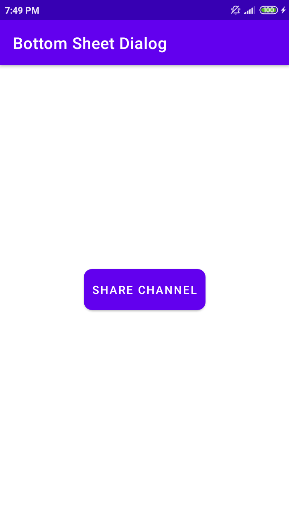

# Bottom Sheet Dialog

Add the following dependencies below to your module build.gradle file:
```groovy:
// material design
implementation 'com.google.android.material:material:1.8.0-alpha02'

// rounded image view
implementation 'com.makeramen:roundedimageview:2.3.0'
```
\
\
\
 &nbsp;&nbsp;&nbsp; 